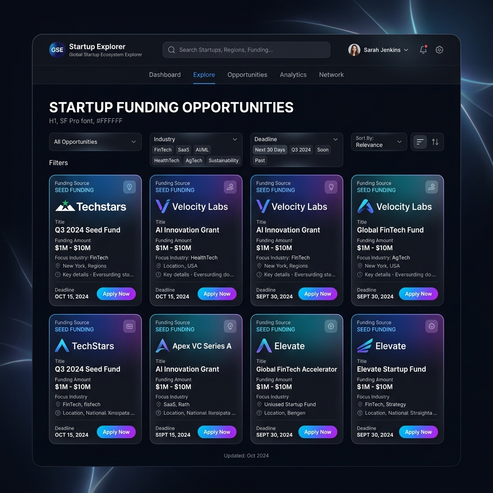

# Startup-Global: Explorador del Ecosistema Global de Startups

**Descubra más de 32,500 opciones de financiación para startups, subvenciones, aceleradores y ventajas en la nube en más de 190 países y 100 industrias.**

Startup-Global es una plataforma de código abierto diseñada para democratizar el acceso al capital y a las oportunidades de crecimiento para los fundadores de todo el mundo.

Consulte [CONTRIBUTING.md](CONTRIBUTING.md) para contribuir.
